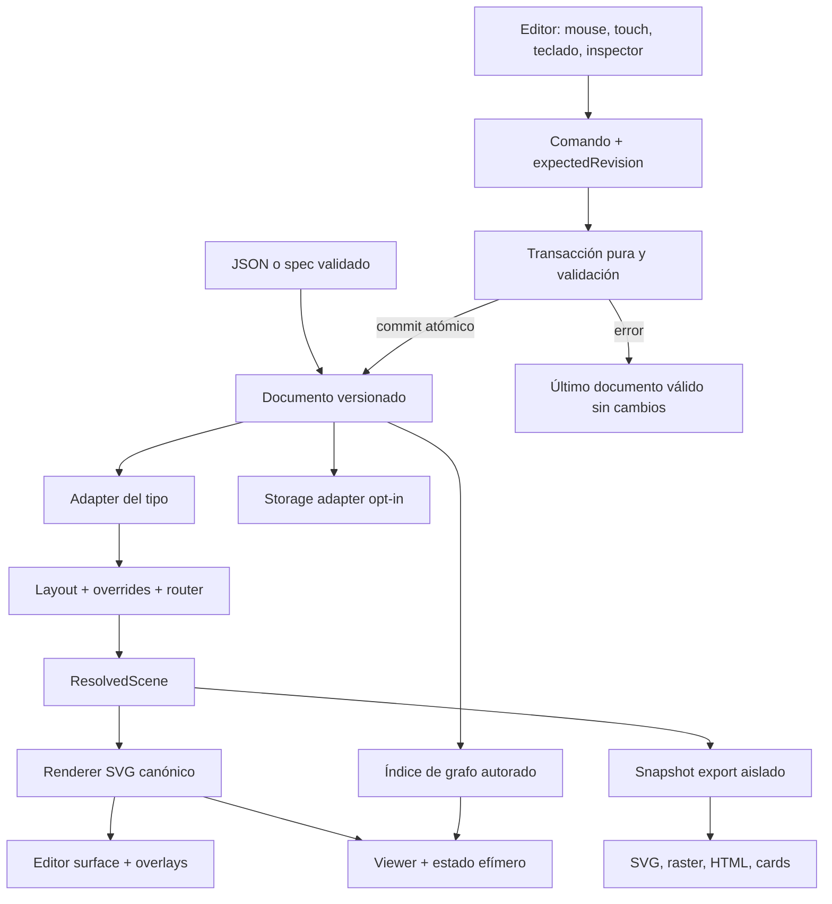

# 3. Arquitectura y decisiones propuestas

## ADR-EC-01 — Evolución aditiva, no sustitución

**Decisión:** mantener `DiagramSpec`, `layoutDiagram`, `DiagramLayout`, `DiagramCanvas`, registry y sus subpaths. Añadir documento y capacidades en subpaths opt-in. `GraphDiagramSpec` pertenece a `EditorSpec`, no a `DiagramSpec`. El root no reexporta código del editor/viewer/export.

**Razón:** consumidores con switches exhaustivos de siete tipos siguen compilando. Cambiar el union actual sería una decisión breaking, no un detalle de implementación. Una futura major podrá unificarlo con una migración explícita.

`src/types.ts` sigue siendo la fuente de contratos serializables, reexportando definiciones auxiliares desde `src/editor-core/types.ts` si se divide el archivo; el generador debe resolverlos desde esa raíz. Tipos React viven en `/editor` o `/viewer`, nunca en el schema de datos. Se generan schemas de Document/Fragment/Graph junto a los ocho existentes y un validator standalone nuevo; no se edita el actual a mano.

## ADR-EC-02 — Cuatro autoridades, sin duplicación del grafo

| Autoridad | Contiene | No contiene |
|---|---|---|
| `DiagramDocument` | Spec semántico, scene autorada, presentación, metadata y vistas | Hover, selección, cámaras temporales, history, funciones |
| `EditorSession` | Selección, viewport, tool, draft gesture/text, undo/redo y save state | Topología alternativa |
| `ResolvedScene` | Layout calculado, bounds, índices, port anchors, diagnósticos | Datos persistidos inventados o editor state |
| `ViewerState` | Focus, route/reach, lens, step, minimap/collapse | Datos que reemplacen el spec |

Todo graph query se construye sobre adapters de `document.spec`, no buscando `data-*` en el DOM. Cada snapshot de query incluye document id y revision. Cambia cualquiera: invalidar el resultado, overlays y acciones de export hasta recalcular. Nunca usar una ruta antigua para una revisión nueva.

## ADR-EC-03 — SVG compartido; interacciones fuera del renderer

Extraer gradualmente del canvas primitivos deterministas: defs, containers/lifelines, edges, labels, nodes y continuations. `DiagramCanvas` conserva su firma y wrappers accesibles actuales; el renderer puro no instala listeners ni tooltips. Editor surface usa sus mismos primitivos y añade hit areas y handles excluidos de export.

Introducir `ResolvedScene = {layout, worldBounds, origin, diagnostics}`. Para posiciones negativas, `origin` traduce el render a viewBox positivo sin reescribir `scene.nodes`. No cambiar la forma de `DiagramLayout` para consumidores actuales. Export incluye límites reales de edges, labels, markers, groups, continuations y padding, no solo bounds de nodos.

El adapter DOM hace screen→world con matriz SVG inversa ([API documentada](https://developer.mozilla.org/en-US/docs/Web/API/SVGGraphicsElement/getScreenCTM)); el núcleo matemático no importa DOM. El viewport aplica transform una vez sobre la escena. No volver a ejecutar todos los layouts durante cada pointermove.

**Tradeoff:** más trabajo de interacciones propias, menos discrepancia entre la lectura actual y el export. React Flow queda como alternativa documentada, no como dependencia instalada por este spec.

## ADR-EC-04 — Transacciones puras e historial acotado

1. Crear draft a partir del snapshot actual y capturar `baseRevision`.
2. Reducir comandos contra copia inmutable; adapters nunca mutan input.
3. Validar límites, referencias y restricciones del tipo. Quality edit informa warnings pero los errores estructurales bloquean.
4. Si cambia contenido canónico, incrementar revision una vez, añadir un entry de historial, limpiar redo, actualizar selección que dejó de existir y emitir una notificación `commit`.
5. Sin cambio: devolver `noop`, sin nueva revision, history ni autosave.
6. Cualquier error, expectedRevision incorrecta o cancelación: conservar snapshot anterior byte-equivalente.

Undo/redo usa snapshots inmutables de **contenido** inicialmente, no inversas parciales difíciles de comprobar. Se acota a 100 transacciones **y** 8 MiB de coste serializado conservador (antes/después); se evacuan las más antiguas hasta cumplir ambos. Si una transacción excede 8 MiB se rechaza antes de commit con `history.capacity`, salvo una operación explícita de reemplazo que pide limpiar historial. UI muestra profundidad realmente disponible. No se promete 100 pasos para cualquier tamaño.

Revision es monotonía de edición en la sesión/documento, no timestamp ni token CAS del storage. Undo restaura contenido pero asigna `current.revision + 1`. Dirty compara contenido canónico excluyendo revision contra el último guardado exitoso; volver por undo a ese contenido limpia dirty.

No fusionar por un timeout global. Gestures y edición de un campo tienen `transactionId`; key-repeat agrupa desde keydown hasta keyup/blur. Segundo pointer inesperado cancela node-drag y empieza navegación solo si la policy touch lo admite.

## ADR-EC-05 — Estado explícito y compuesto

`createEditorStore` devuelve store por instancia con snapshot estable, subscribe, dispatch, transaction, undo/redo, replaceDocument y dispose. Sin registry global obligatorio. La aplicación puede poseer el store; un helper hook puede crearlo una vez y liberarlo al desmontar. La selección/viewport tienen canales de notificación separados del commit para no disparar persistencia.

API React compuesta: `DiagramEditor.Root`, `Surface`, `Toolbar`, `Inspector`, `Outline`, `Status`, `Minimap`. No convertir `DiagramCanvas` en un componente con docenas de flags. `DiagramViewer` es un componente diferente que carece de comandos mutantes. React 18 exige `useContext`/`useSyncExternalStore`, no adoptar exclusivamente APIs React 19.

Host controlado: snapshot externo se aplica mediante `replaceDocument(next, {expectedRevision, history:'reset'})`. Nunca mezclar `value` externo y `defaultValue` como autoridades simultáneas. Si llega mientras hay draft local: cancelar draft, mostrar conflicto, conservar el doc actual hasta `acceptExternal` explícito. Si es eco del mismo commit (id/revision/digest), ignorar. Reemplazo aceptado limpia history, selection huérfana y queries.

Handlers y callbacks están solo en configuración trusted. `permissions` controla UX (edit/export/save) y se comprueba también en dispatch; no constituye seguridad backend. Todo handler global se retira con `dispose`.

## ADR-EC-06 — Dos lanes de validación

**Validity (siempre):** JSON/plain data → tamaño/profundidad → schema generado → invariantes semánticas → límites/permissions/capabilities. Fallo rechaza import/commit.

**Quality (seleccionable):** geometría → legibilidad → artifact checks. `edit` entrega warnings y permite progresar; `publish` exige cero errores geométricos (edge atraviesa nodo ajeno, texto recortado, endpoints inválidos) para un receipt verificado. Importar un documento bien formado con mala composición no destruye datos: se abre con advertencias; export `quality:'edit'` sigue siendo posible y no se etiqueta como verificado.

Diagnóstico estable: code, severity, JSON pointer, subject ID, evidence medida y supportedFixes enumeradas. No crear un repair control que el tipo no soporta. Tipos de fixes: move, resize, set-waypoints, move-label, change-spacing, shorten-text-manually y select-layout. Nunca aplicar texto generado automáticamente.

La última preview válida es por revisión candidata, no por orden de finalización async. Texto A lento / texto B rápido: solo B puede promoverse. Worker o layout provider debe incluir document id, baseRevision, requestId y AbortSignal; aborto no muta documentos ni artifacts.

## ADR-EC-07 — Módulos y costes explícitos

| Subpath futuro | Responsabilidad | Dependencias permitidas |
|---|---|---|
| `/editor-core` | Documento, adapters, commands, store, history, viewport math | Tipos, validation y utilidades puras; no React/DOM/storage |
| `/graph` | Reach, route, lens, exact diff | Tipos, índices puros |
| `/editor` | Componentes, pointer/keyboard, inspector | React peer, editor-core, renderer |
| `/viewer` | Lectura semántica, story y presentación | React peer, graph, renderer |
| `/export` | Snapshot/SVG puro, contracts y bytes | Renderer/scene; no acceso global al DOM en import |
| `/export/browser` | Raster, clipboard, impresión, WebM | Web APIs comprobadas al invocar |
| `/export/html` | Ensamblar HTML con runtime standalone empaquetado | Asset runtime interno versionado, sin CDN |
| `/persistence` | Storage interfaces, memory/localStorage adapters | Web APIs solo al crear adapter browser |

Archivos destino se listan en tareas. `src/types.ts` puede reexportar tipos usando `export type`; no arrastra entrypoints runtime. `tsup` mantiene splitting y limpia dist. Separar `use client` exactamente como `scripts/inject-use-client.mjs` exige; módulos puros deben poder importarse en Node y Next server.

`site/studio.html` tendrá entrada propia. Landing/docs enlazan a ella mediante navegación normal, no import dinámico desde sus graphs (el budget actual contabiliza imports lazy). Presupuesto inicial propuesto Studio: 250 KiB JS gzip, 16 KiB CSS gzip; existente sigue 175/12 KiB. Paquete sigue 2 MiB packed/8 MiB unpacked. Nuevos límites deben registrarse con medición en la tarea de budgets, no elevar los existentes para esconder regresiones.

## ADR-EC-08 — Portabilidad antes que captura visual

Export se calcula desde `document + ResolvedScene + resolved theme + opciones`. No clonar el canvas vivo como autoridad de datos. Fijar timestamp/document revision al comenzar, cargar fuentes requeridas, crear árbol SVG nuevo aislado y serializar con IDs locales deterministas. Las capacidades cliente rasterizan ese SVG.

HTML export embebe un runtime viewer construido a partir de los mismos módulos (puede incluir React/ReactDOM bundled en el artifact, nunca exigir CDN), SVG y JSON escapado. Sin editor, autosave ni nuevos requests por defecto. M2 optimiza tamaño antes de release, sin inventar otro motor semántico en vanilla con comportamiento divergente.

## ADR-EC-09 — Persistence opt-in y límites de autoridad

No guardar por montar un componente. Memory adapter por defecto; host o usuario activa persistent adapter. Documento y texto inválido se guardan en slots separados. `save` usa token opaco `expectedToken` y respuesta `token`, no compara exclusivamente revision para resolver dos tabs. La interfaz permite CAS real en un backend; localStorage **no** puede prometer atomicidad distribuida. El adapter browser usa Web Locks cuando exista y detección de conflicto por revision/token + storage event; sin locks ofrece modo single-tab y bloquea autosave al detectar otro writer, no last-write-wins silencioso.

No adoptar CRDT ni sincronización de red en M1/M2. Arquitectura preparada no equivale a colaboración implementada.

## Riesgos y gates de arquitectura

| Riesgo | Mitigación verificable |
|---|---|
| Refactor del renderer cambia snapshots de siete tipos | Caracterización byte/geometry + visual por tema antes del refactor |
| Scene libre corrompe tipo temporal | Capabilities/adapters y tests negativos por tipo |
| Store privado se duplica entre subpaths | Tarball cross-entry tests y dos instancias aisladas |
| Texto multilingüe invalida alturas | Fixture de labels largos/Unicode; medición publish con fuentes cargadas |
| Router de obstáculos consume demasiado | Límite por query, cancelación, fallback diagnosticado y benchmark fijo |
| HTML export mete XSS o dependencias de red | Tests `</script>`, SVG URLs, CSP y file:// offline |
| Estado viewer entra en export | Export fresh scene, snapshot inmutabilidad y tests con todas las interacciones activas |
| Trabajo se vuelve un editor genérico sin final | M2 cerrado; exclusiones y M3 separados |
