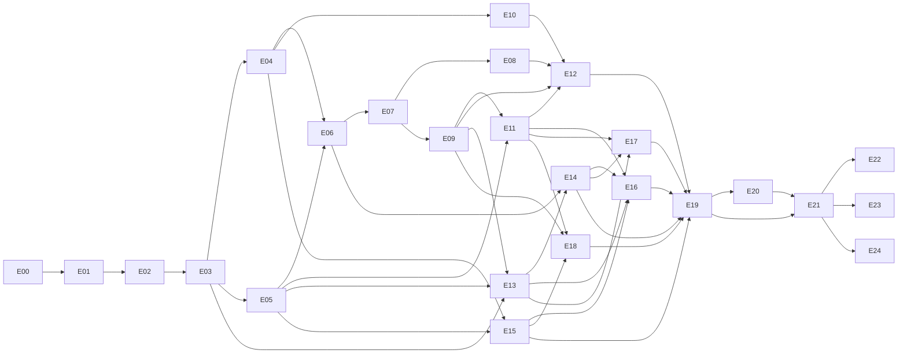

# 7. Plan de ejecución

La fuente machine-readable es `traceability.json`; [task-catalog.md](task-catalog.md) detalla las 25 tareas con dependencias, archivos destino, RED, GREEN, REFACTOR y criterio de cierre. [test-catalog.md](test-catalog.md) enlaza cada requisito con sus dos escenarios. El checker impide tareas/requisitos huérfanos o ciclos.

## 7.1 Orden y gates

| Hito | Tareas | Gate de salida |
|---|---|---|
| M0 | E00–E04 | Contrato validado + adapters + historial; legacy intacto; ningún UI todavía necesario |
| M1 | E05–E12 | Crear/editar/configurar/save/import/undo y JSON/SVG/PNG en Studio y consumidor externo |
| M2 | E13–E21 | Viewer, calidad, HTML offline, cards, plugins y todos los gates de producción |
| M3 | E22–E24 | Extensiones aisladas con sus propios gates; no atrasan M2 por defecto |

El orden numérico es válido y seguro para ejecución por una sola persona/agente. Los `dependsOn` permiten dividir trabajo, pero **este spec no autoriza crear subagentes o tareas remotas automáticamente**. Repartir tareas solo si el usuario lo solicita. Source, generadores y dist se coordinan en una integración única por rebanada para evitar colisiones.

## 7.2 Primeras acciones, sin decisiones pendientes

1. Verificar git status y preservar trabajo preexistente. Crear rama `alanslzrr/editable-canvas-foundation` cuando se inicie implementación; no es necesario crearla para leer el spec.
2. Ejecutar install frozen + baseline `pnpm check`; comprobar versión Node/pnpm.
3. Verificar spec y tipos. E00 añade caracterización sin modificar el comportamiento.
4. Activar seeds M0. Ejecutar solo documento hasta E01/E02 y luego store en E04; no ocultar tests activos que aún estén RED al entregar un hito.
5. Implementar contratos/generador/validator/fixtures por el orden E01–E04. Antes de UI, demostrar undo/redo, stable IDs y rejection atomicity en Node.
6. M1 comienza por extracción de renderer conservadora. No empezar con toolbar/inspector antes de tener scene+commands probados.

## 7.3 Responsabilidades y límites de cambios

- Los archivos listados en tareas son **destinos propuestos**, no archivos que se afirma que ya existen. La distribución final de helpers puede refinarse sin cambiar contratos ni borrar tests.
- Mantener `src/types.ts` como entrada del modelo serializable. Cambiar generador antes de editar schema outputs. Crear índice de exports de editor-core como parte E01; export map público se conecta en E12 después de pruebas unit.
- Una tarea puede necesitar más de un commit; commits convencionales por responsabilidad, preferentemente ≤3 archivos manuales separables. Outputs generados correspondientes pueden requerir más archivos y se justifican como una unidad con su fuente.
- Commit de contratos, de lógica y de UI separados cuando sea seguro. Ejemplos: `feat(editor-core): normalize versioned documents with stable relation ids`, `test(editor-core): cover atomic undo and stale revision rejection`, `feat(editor): add pointer-captured viewport gestures`.
- No trailers de coautor ni metadata de generación. No cambios a tokens secretos, permisos de cuenta, instalación de servicios o publicación por ejecutar el plan.
- Evitar refactors globales del site, migración de tooling o upgrades de dependencias no exigidos por una tarea. Agregar dependencia solo con tradeoff y medida en su ADR.

## 7.4 Scope cuts que requieren honestidad

Si tiempo/coste obliga a recortar, se puede entregar **M1 editor local** como candidato limitado; no afirmar HTML offline, semantic viewer o paridad con Archify. Si un tipo solo permite reorder/inspector, debe mostrarse así, no “drag libre” genérico. No sacar del scope una capacidad P0 sin actualizar requisitos, tests y docs.

M3 es separable por diseño. Colaboración, importador Archify/Mermaid, SaaS y generación con modelos requieren nuevos specs; no son tareas escondidas pendientes de M2.

No se da una fecha de entrega ni una estimación precisa sin medir E00–E06. Registrar throughput y riesgos al terminar esos fundamentos y estimar el trabajo restante con evidencia. Este plan es una secuencia técnica, no una promesa de calendario.

## 7.5 Criterio común de cierre por tarea

- Todos sus R/T están verdes o la tarea sigue abierta; no marcar closed porque el happy path funciona.
- Nuevo API tiene ejemplo, error contract y pruebas consumidor cuando se publica.
- Invariantes de identity, rollback, last-good y aislamiento siguen verdes.
- Archivos generados están sincronizados y diff revisado.
- Evidencia de comandos y checks faltantes registrada.
- No se cambió scope sin actualizar el spec, traceability y catálogo generado.

## Prompt operativo de inicio

> Implementa E00 y después E01 del spec `docs/specs/editable-canvas/README.md`. Lee AGENTS.md y los contratos antes de modificar producción. Mantén los siete DiagramSpec públicos, registra RED de comportamiento antes de implementar, usa las semillas de TDD sin sobreescribir tests, genera schemas/dist por sus comandos y verifica consumo del paquete. No avances a M1, no publiques y no declares una capacidad implementada si solo existe en el spec. Al terminar, informa tareas y pruebas ejecutadas, pendientes y riesgos concretos.
